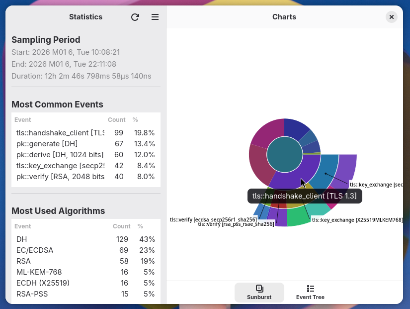

# Crypto Usage Analyzer

A native GNOME application for visualizing [crypto-auditing][crypto-auditing] data with an interactive sunburst chart, inspired by [Baobab][baobab]'s disk usage visualization. Built with modern libadwaita design principles.

## Screenshots

<div align="center">
    
</div>

## Features

- **Interactive Sunburst Chart**: Visualize cryptographic operations in a hierarchical circular diagram
- **Modern GNOME Design**: Built with libadwaita for a polished, native GNOME 40+ look and feel
- **Click to Zoom**: Click segments to drill down, reset to return to full view
- **Detailed Tooltips**: Hover to see operation details, counts, and breakdowns
- **Event Tree Sidebar**: Hierarchical view of all cryptographic operations with counts
- **File Chooser**: Open any `audit.json` file generated by crypto-auditing

## Building

### Dependencies

You need GTK4 and libadwaita development libraries installed:

**Fedora/RHEL:**
```bash
sudo dnf install gtk4-devel libadwaita-devel cairo-devel meson
```

**Debian/Ubuntu:**
```bash
sudo apt install libgtk-4-dev libadwaita-1-dev libcairo2-dev meson
```

**Arch:**
```bash
sudo pacman -S gtk4 libadwaita cairo meson
```

### Build with Meson

```bash
cd crypto-usage-analyzer
meson setup builddir --prefix=/usr/local -Dprofile=release
meson compile -C builddir
```

To install:
```bash
meson install -C builddir
```

For development builds:
```bash
meson setup builddir -Dprofile=development
meson compile -C builddir
```

For detailed interaction patterns, data format specifications, and architecture details, see [CLAUDE.md](CLAUDE.md).

## License

GPL3-or-later

[baobab]: https://apps.gnome.org/Baobab/
[crypto-auditing]: https://github.com/latchset/crypto-auditing
